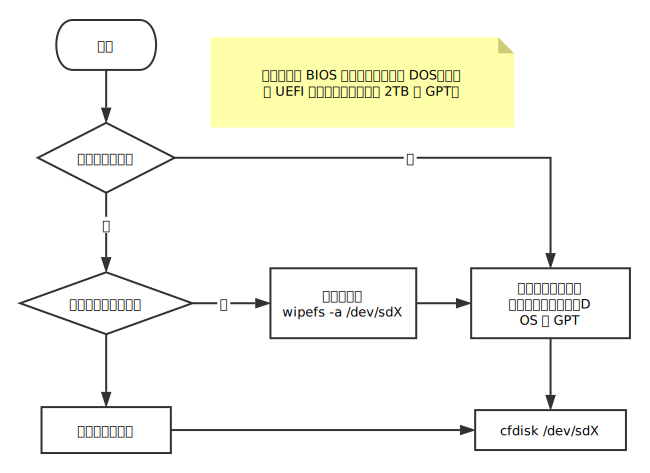

# 安装 Arch Linux

## 1、优盘启动

1.1 Windows 系统

用[Rufus 软件](https://rufus.akeo.ie/)将 Arch Linux 的[安装镜像](https://www.archlinux.org/download/)写入优盘。

1.2 Linux 系统

用`lsblk`命令找出优盘的名称作为 of 的参数值，并确认优盘没有被挂载。

```
dd bs=4M if=/path/to/archlinux.iso of=/dev/sdx status=progress && sync
```

1.3 重启电脑，进入BIOS界面

Here's a list of common BIOS keys by brand.
ASRock: F2 or DEL
ASUS: F2 for all PCs, F2 or DEL for Motherboards
Acer: F2 or DEL
Dell: F2 or F12
ECS: DEL
Gigabyte / Aorus: F2 or DEL
HP: F10
Lenovo (Consumer Laptops): F2 or Fn + F2
Lenovo (Desktops): F1
Lenovo (ThinkPads): Enter then F1.
MSI: DEL for motherboards and PCs
Microsoft Surface Tablets: Press and hold volume up button.
Origin PC: F2
Samsung: F2
Toshiba: F2
Zotac: DEL

用优盘启动电脑，进入安装 Arch Linux 的命令行界面。

## 2、预备工作

2.1 设置键盘布局

```
loadkeys us
```

2.2 设置终端字体

如果觉得字体有点小的话，可换成一个大号的字体。

```
setfont sun12x22
```

2.3 连接到网络

- 有线网络

安装程序会在启动时自动运行`dhcpcd`守护进程以尝试有线连接。

如果网络不可用，需要手动配置网络，参见下一章的内容。

- 无线网络

用`ip a`或`iw dev`命令查到无线网卡的设备名称。

```
wifi-menu -o wlp3s0
```

用`ping`命令检测是否能连上因特网，按 Ctrl+C 结束命令。

```
ping baidu.com
```

或

```
ping 8.8.8.8
```

2.4 更新系统时间

```
timedatectl set-ntp true
```

用`timedatectl status`检查服务状态。

2.5 打开另一个终端界面

按 Ctrl+Atl+F2，输入 root，回车。

打开 Arch Linux 的 Wiki 网页

```
elinks wiki.archlinux.org
```

按 Ctrl+Atl+F1，切换到原来的界面。

## 3、给硬盘分区

> 警告: 分区操作可能会清除数据，请确保已备份重要的数据。

3.1 显示所有连接到系统的存储设备和分区状况

```
lsblk --fs --paths
```

3.2 创建及编辑硬盘分区表，指定所需的目标设备


DOS 分区表最大支持 2TB 的硬盘，超过 2TB 需使用 GPT 分区表。
如果选了 DOS 分区模式，要把启动分区在 cfdisk 中设置成 bootable。
分区方案可根据具体的使用需求来确定。UEFI 启动需要一个 EFI 系统分区，容量为 512MiB 或更大。

3.3 格式化分区

EFI 分区 (sda1) 须使用 FAT32 格式，分区类型设成**EFI System**。

```
mkfs.fat -F32 /dev/sda1
```

其他分区格式化为 Ext4

```
mkfs.ext4 /dev/sda2
mkfs.ext4 /dev/sda3
```

3.4 挂载硬盘分区

挂载要安装系统的分区，这里选 sda2

```
mount /dev/sda2 /mnt
mkdir /mnt/boot
mount /dev/sda1 /mnt/boot
mkdir /mnt/home
mount /dev/sda3 /mnt/home
```

## 4、安装系统

4.1 选择镜像服务器

```
nano /etc/pacman.d/mirrorlist
```

可参照[MirrorStatus](https://www.archlinux.org/mirrors/status/#successful)页面将传输速度较快的服务器排到前面。

4.2 安装基本软件包

```
pacstrap /mnt base base-devel linux linux-firmware
```

4.3 生成 fstab 文件

```
genfstab -U -p /mnt >> /mnt/etc/fstab
```

4.4 切换根目录为新安装系统的根目录

```
arch-chroot /mnt
```

4.5 安装 bootloader，分两种情况

- EFI 启动

确认以 UEFI 模式启动，并且 EFI 系统分区挂载的路径为/boot。
可用 ls /sys/firmware/efi/efivars 命令进行确认。

安装 systemd-boot 到 EFI 系统分区：

```
bootctl install
```

编辑引导系统的配置文件

```
nano /boot/loader/loader.conf
```

> ```
>   timeout  3
>   editor   no
>   default  arch.conf
> ```

```

查看硬盘分区的UUID
```

blkid -s PARTUUID -o value /dev/sda2

```

编辑引导项的配置文件，参照/usr/share/systemd/bootctl/中的示例
```

nano /boot/loader/entries/arch.conf

````
> ```
  title          Arch Linux
  linux          /vmlinuz-linux
  initrd         /initramfs-linux.img
  options        root=PARTUUID=14420948-2cea-4de7-b042-40f67c618660 rw
````

- BIOS 启动

```
pacman -S grub
grub-install --recheck /dev/sda
pacman -S os-prober
grub-mkconfig -o /boot/grub/grub.cfg
```

4.6 如果需要使用无线网卡，用 iwd 连 WIFI 网络

```
pacman -S iwd
systemctl start iwd
iwctl
[iwd]# help
[iwd]# device list
[iwd]# station wlan0 scan
[iwd]# station wlan0 get-networks
[iwd]# station wlan0 connect "WPA2AP NAME"
```

如果需要连接蓝牙设备

```
pacman -S bluez bluez-libs bluez-utils
systemctl start bluetooth
systemctl enable bluetooth
```

## 5、完成安装

5.1 设置 root 帐号的登录密码

```
passwd
```

5.2 退出 chroot 环境，卸载分区，拔掉优盘，重启系统

```
exit
umount -R /mnt
reboot
```
